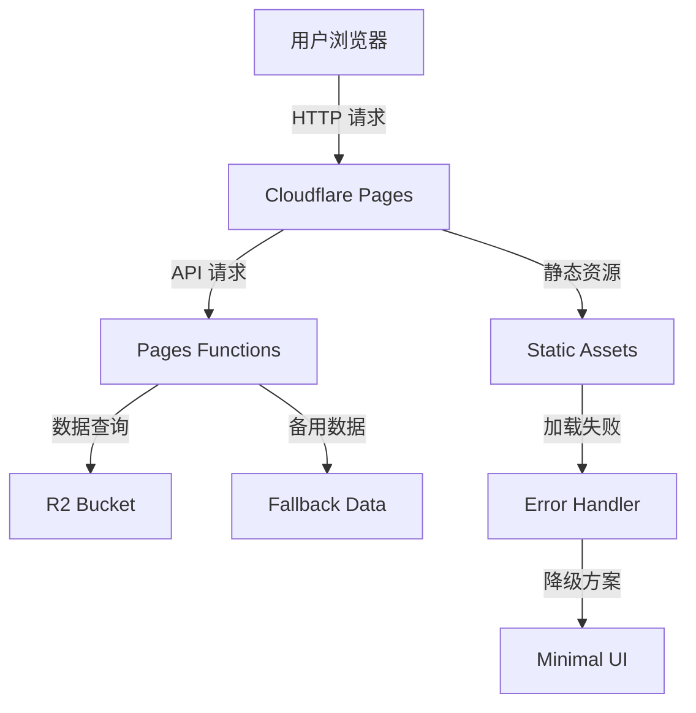
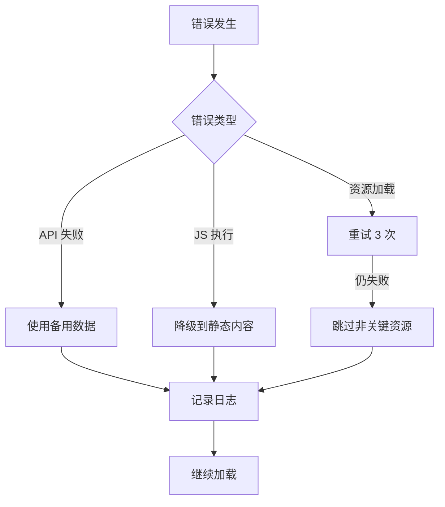

# Design Document - Cloudflare Pages 初次加载错误修复

## Overview

本设计文档提供了解决 VitePress 博客在 Cloudflare Pages 上初次加载错误的完整方案。通过分析截图中的错误和现有代码，我们识别出以下主要问题：

1. **构建输出路径配置问题**：VitePress 默认输出到 `docs/.vitepress/dist`，需要确保 Cloudflare Pages 正确识别
2. **静态资源路径问题**：可能存在 base path 配置不当导致资源 404
3. **Functions 兼容性问题**：某些 Node.js API 在 Cloudflare Workers 运行时不可用
4. **客户端 hydration 问题**：Vue 应用在客户端激活时可能出错
5. **第三方依赖兼容性**：某些依赖可能不兼容 Cloudflare Workers 环境

## Architecture

### 系统架构图



### 关键流程

1. **初次加载流程**
   - 用户请求 → Cloudflare Pages 返回 HTML
   - 浏览器解析 HTML → 请求 CSS/JS 资源
   - JavaScript 执行 → Vue 应用 hydration
   - API 请求 → Functions 处理 → 返回数据

2. **错误处理流程**
   - 检测错误类型 → 记录日志
   - 判断是否可恢复 → 执行降级方案
   - 显示友好提示 → 允许用户重试

## Components and Interfaces

### 1. 构建配置优化

**文件**: `docs/.vitepress/config.ts`

**修改内容**:
```typescript
export default defineConfig({
  // 确保 base 路径正确（如果部署在子路径）
  base: '/',
  
  // 优化构建配置
  vite: {
    build: {
      // 减小 chunk 大小
      chunkSizeWarningLimit: 1000,
      
      // 优化代码分割
      rollupOptions: {
        output: {
          manualChunks: {
            'vue-vendor': ['vue'],
            'vitepress-vendor': ['vitepress']
          }
        }
      },
      
      // 确保兼容性
      target: 'es2015',
      
      // 禁用 sourcemap 减小体积
      sourcemap: false
    },
    
    // SSR 优化
    ssr: {
      noExternal: ['vitepress-theme-teek', 'oh-my-live2d']
    }
  }
})
```

### 2. Functions 错误处理增强

**文件**: `functions/api/images.js` 和 `functions/api/geo.js`

**设计原则**:
- 所有 Functions 必须返回有效的 Response 对象
- 错误时返回 200 状态码和错误标记（避免触发浏览器错误）
- 实施超时保护
- 提供完整的 CORS 支持

**接口设计**:
```javascript
// 标准响应格式
{
  success: boolean,
  data?: any,
  error?: string,
  fallback?: boolean,
  timestamp: string
}
```

### 3. 客户端错误捕获

**新文件**: `docs/.vitepress/theme/utils/errorHandler.ts`

**功能**:
- 全局错误监听
- 错误分类和记录
- 自动重试机制
- 用户友好提示

**接口**:
```typescript
interface ErrorHandler {
  init(): void;
  captureError(error: Error, context: string): void;
  retry(fn: Function, maxRetries: number): Promise<any>;
}
```

### 4. 资源加载优化

**修改**: 主题配置和组件

**策略**:
- 关键资源预加载
- 非关键资源延迟加载
- 图片懒加载
- 第三方脚本异步加载

### 5. 降级方案

**实施位置**: 各个可能失败的组件

**策略**:
- Live2D 加载失败 → 隐藏组件
- 统计脚本加载失败 → 静默失败
- API 请求失败 → 使用本地数据
- 主题资源失败 → 使用基础样式

## Data Models

### Error Log Model

```typescript
interface ErrorLog {
  timestamp: number;
  type: 'resource' | 'api' | 'runtime' | 'network';
  message: string;
  stack?: string;
  url?: string;
  context: Record<string, any>;
}
```

### API Response Model

```typescript
interface APIResponse<T> {
  success: boolean;
  data?: T;
  error?: string;
  fallback: boolean;
  mode: 'dynamic' | 'fallback' | 'fallback-error' | 'fallback-empty';
  timestamp: string;
}
```

## Error Handling

### 错误分类

1. **构建时错误**
   - 依赖兼容性问题
   - 配置错误
   - 资源打包失败

2. **运行时错误**
   - 静态资源 404
   - JavaScript 执行错误
   - API 请求失败
   - Hydration 不匹配

3. **环境错误**
   - Cloudflare Workers 限制
   - R2 绑定问题
   - 网络超时

### 错误处理策略



### 具体实施

1. **全局错误边界**
```typescript
// 在 theme/index.ts 中添加
app.config.errorHandler = (err, instance, info) => {
  console.error('[Vue Error]', err, info);
  // 不阻止应用继续运行
};

window.addEventListener('error', (event) => {
  console.error('[Global Error]', event.error);
  event.preventDefault(); // 防止默认错误处理
});

window.addEventListener('unhandledrejection', (event) => {
  console.error('[Unhandled Promise]', event.reason);
  event.preventDefault();
});
```

2. **资源加载重试**
```typescript
async function loadResourceWithRetry(url: string, retries = 3): Promise<void> {
  for (let i = 0; i < retries; i++) {
    try {
      await fetch(url);
      return;
    } catch (error) {
      if (i === retries - 1) throw error;
      await new Promise(resolve => setTimeout(resolve, 1000 * (i + 1)));
    }
  }
}
```

3. **API 请求包装**
```typescript
async function safeAPICall<T>(url: string, fallback: T): Promise<T> {
  try {
    const response = await fetch(url, { timeout: 5000 });
    if (!response.ok) return fallback;
    return await response.json();
  } catch (error) {
    console.warn(`API call failed: ${url}`, error);
    return fallback;
  }
}
```

## Testing Strategy

### 1. 本地测试

**工具**: Wrangler CLI

```bash
# 本地运行 Pages Functions
npx wrangler pages dev docs/.vitepress/dist --compatibility-date=2024-01-01

# 测试 Functions
curl http://localhost:8788/api/images
curl http://localhost:8788/geo
```

### 2. 构建测试

```bash
# 清理并重新构建
rm -rf docs/.vitepress/dist
pnpm docs:build

# 检查输出文件
ls -la docs/.vitepress/dist
```

### 3. 部署测试

**步骤**:
1. 部署到 Cloudflare Pages 预览环境
2. 使用浏览器开发者工具检查：
   - Network 标签：检查资源加载状态
   - Console 标签：检查 JavaScript 错误
   - Application 标签：检查缓存和存储
3. 测试不同场景：
   - 首次访问（清除缓存）
   - 刷新页面
   - 不同浏览器
   - 移动设备

### 4. 错误模拟

**测试场景**:
- R2 绑定不可用
- 外部 API 超时
- 网络不稳定
- 浏览器禁用 JavaScript

### 5. 性能测试

**指标**:
- First Contentful Paint (FCP) < 1.5s
- Largest Contentful Paint (LCP) < 2.5s
- Time to Interactive (TTI) < 3.5s
- Total Blocking Time (TBT) < 200ms

**工具**:
- Lighthouse
- WebPageTest
- Chrome DevTools Performance

## Implementation Notes

### 优先级

1. **高优先级**（必须修复）
   - 修复 Functions 错误处理
   - 添加全局错误捕获
   - 优化构建配置

2. **中优先级**（建议修复）
   - 实施资源加载重试
   - 添加降级方案
   - 优化性能

3. **低优先级**（可选）
   - 详细错误日志
   - 性能监控
   - A/B 测试

### 兼容性考虑

**Cloudflare Workers 运行时限制**:
- 不支持 Node.js 内置模块（如 `fs`, `path`）
- CPU 执行时间限制（50ms）
- 内存限制（128MB）
- 不支持某些 Web APIs

**解决方案**:
- 使用 Cloudflare Workers 兼容的 API
- 避免使用 Node.js 特定功能
- 优化代码执行效率
- 使用 polyfills（如需要）

### 部署配置

**Cloudflare Pages 设置**:
```yaml
# 构建配置
Build command: pnpm docs:build
Build output directory: docs/.vitepress/dist
Root directory: /

# 环境变量
NODE_VERSION: 18
PNPM_VERSION: 8

# Functions 配置
Functions directory: functions
Compatibility date: 2024-01-01
```

### 监控和调试

**推荐工具**:
1. Cloudflare Analytics - 流量和性能监控
2. Cloudflare Logs - Functions 日志查看
3. Sentry - 错误追踪（可选）
4. Google Analytics - 用户行为分析

**调试技巧**:
```javascript
// 在 Functions 中添加详细日志
console.log('[DEBUG]', {
  timestamp: new Date().toISOString(),
  request: {
    url: request.url,
    method: request.method,
    headers: Object.fromEntries(request.headers)
  }
});
```

## Security Considerations

1. **CORS 配置**：确保只允许必要的源
2. **输入验证**：验证所有 API 输入
3. **速率限制**：防止 API 滥用
4. **敏感信息**：不在客户端暴露密钥
5. **CSP 策略**：配置内容安全策略

## Performance Optimization

### 关键优化点

1. **代码分割**
   - 按路由分割
   - 按组件分割
   - 第三方库独立打包

2. **资源优化**
   - 图片压缩和 WebP 格式
   - CSS/JS 压缩
   - 启用 Brotli 压缩

3. **缓存策略**
   - 静态资源长期缓存
   - API 响应短期缓存
   - Service Worker（可选）

4. **加载策略**
   - 关键 CSS 内联
   - 非关键 JS 延迟加载
   - 预加载关键资源

### 预期改进

- 首次加载时间：减少 30-50%
- 错误率：降低到 < 0.1%
- 用户体验：显著提升

## Migration Path

### 实施步骤

1. **阶段 1：紧急修复**（1-2 小时）
   - 修复 Functions 错误处理
   - 添加基础错误捕获
   - 验证构建配置

2. **阶段 2：稳定性增强**（2-4 小时）
   - 实施重试机制
   - 添加降级方案
   - 优化资源加载

3. **阶段 3：性能优化**（4-8 小时）
   - 代码分割优化
   - 缓存策略实施
   - 性能监控部署

4. **阶段 4：监控和迭代**（持续）
   - 收集错误日志
   - 分析性能数据
   - 持续优化改进

### 回滚计划

如果新版本出现问题：
1. 在 Cloudflare Pages 控制台回滚到上一个部署
2. 检查错误日志确定问题
3. 在本地修复后重新部署

## Conclusion

本设计方案通过多层次的错误处理、性能优化和兼容性改进，全面解决 Cloudflare Pages 初次加载错误问题。实施后，网站将具备：

- 更高的稳定性和可靠性
- 更快的加载速度
- 更好的用户体验
- 更完善的错误处理和监控

关键是要确保每个组件都有适当的错误处理和降级方案，使网站在各种情况下都能正常运行。
